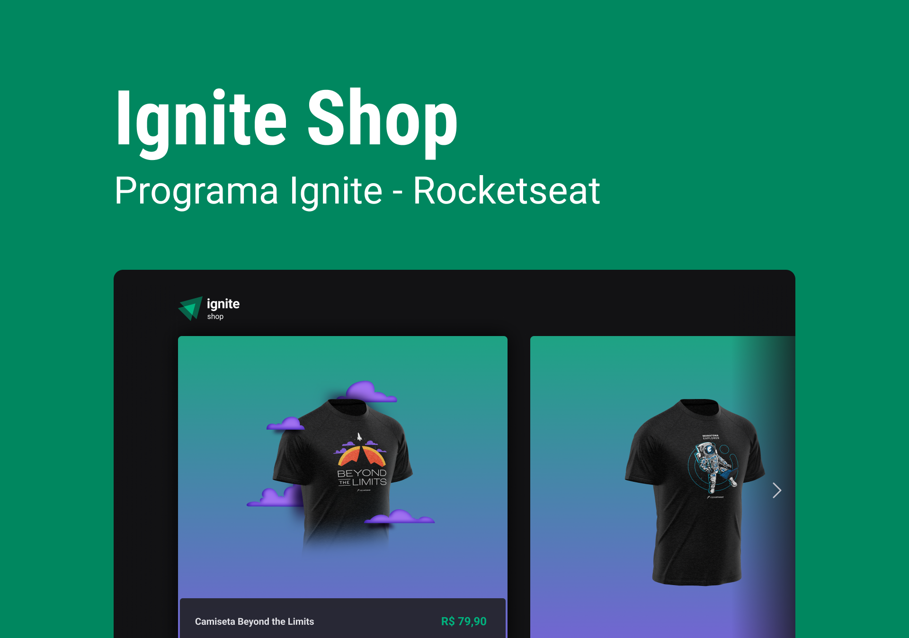

# Ignite Shop 🛍️

<p align="center">
  <a href="https://nextjs.org/"></a>
</p>

<p align="center">
  <a href="#-layout">Layout</a> •
  <a href="#-technologies">Technologies</a> •
  <a href="#-getting-started">Getting started</a> •
  <a href="#-license">License</a>
</p>

<p align="center">
  
</p>

## 🔖 Layout

The author of this layout is [Millena Kupsinsku Martins](https://www.figma.com/@millenakmartins). You can view the project in this [link](https://www.figma.com/file/OIJJEW24DFiJO6XLqHw2DM/Ignite-Shop/duplicate).

## 🚀 Technologies and Concepts

- [NextJS](https://nextjs.org/)
- [TypeScript](https://www.typescriptlang.org/)
- [Stitches](https://stitches.dev/)
- [Keen Slider](https://keen-slider.io/)
- [Stipe](https://stripe.com/br)
- [SSR, SSG, Fallback, Prefetch, Redirect, API Routes](https://nextjs.org/docs/basic-features/pages)

## 💻 Getting started

### Requirements

- [Node.js](https://nodejs.org/en/)
- [Yarn](https://classic.yarnpkg.com/) or [npm](https://www.npmjs.com/package/npm)

**Clone the project and access the folder**

```bash
git clone https://github.com/luancardosoti/ignite22-ignite-shop.git && cd ignite22-ignite-shop
```

**Follow the steps below**

```bash
# Install the dependencies
$ npm i
# Run project
$ npm run dev
```

## 📝 License

This project is licensed under the MIT License - see the [LICENSE](LICENSE) file for details.

---

<p align="center">
  Made
